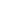
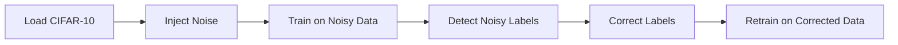

# Label Noise Detection

**Detect and correct noisy labels in image classification using confidence-based heuristics.**

[](https://www.python.org/downloads/)
[](https://opensource.org/licenses/MIT)
[](https://pytorch.org/)
[](https://streamlit.io/)
[](https://github.com)



---

## Overview

Label noise—incorrect labels in training data—degrades model performance. This project demonstrates a two-phase pipeline on CIFAR-10:

1. **Phase 1**: Inject synthetic label noise, train a CNN, and detect potentially mislabeled samples using confidence-based heuristics.
2. **Phase 2**: Correct flagged labels using model predictions and retrain for improved accuracy.

---

## Features

- **Synthetic noise injection** — Randomly corrupt a configurable fraction of labels
- **Confidence-based detection** — Flag samples where the model disagrees with the given label or is uncertain
- **Two-phase training** — Train on noisy data, detect, correct, retrain
- **Metrics dashboard** — Before vs after comparison (accuracy, precision, recall, F1)
- **Visualizations** — Confusion matrices, confidence distribution, training curves
- **Data inspection** — View incorrect and corrected label samples
- **Streamlit UI** — SaaS-style web interface
- **CLI** — Scriptable pipeline via `main.py`

---

## Project Structure

```
3lc-label-noise-detection/
├── app/
│   └── streamlit_app.py    # Streamlit web UI
├── assets/
│   ├── demo.gif            # Demo recording
│   └── ui_screenshot.png   # UI screenshot
├── scripts/
│   └── record_demo.md      # Instructions for recording demo GIF
├── src/
│   ├── data.py             # CIFAR-10 loading, noise injection
│   ├── model.py            # SimpleCNN architecture
│   ├── train.py            # Training and evaluation
│   ├── noise_detection.py  # Confidence-based detection
│   ├── metrics.py          # Classification metrics
│   └── visualizations.py   # Plotting functions
├── main.py                 # CLI entry point
├── requirements.txt
└── README.md
```

---

## Installation

```bash
git clone https://github.com/your-org/3lc-label-noise-detection.git
cd 3lc-label-noise-detection
pip install -r requirements.txt
```

---

## Usage

### CLI

```bash
python main.py \
  --noise-rate 0.2 \
  --epochs 10 \
  --lr 0.001 \
  --confidence-threshold 0.5 \
  --output-dir ./output
```

**Options:**
- `--noise-rate` — Fraction of labels to corrupt (0.0–1.0)
- `--epochs` — Training epochs per phase
- `--lr` — Learning rate
- `--confidence-threshold` — Threshold for flagging low-confidence samples
- `--data-dir` — Data directory (default: `./data`)
- `--output-dir` — Output directory for plots (default: `./output`)
- `--device` — Device (`cuda`, `mps`, or `cpu`)

### Streamlit App

```bash
streamlit run app/streamlit_app.py
```

Then open [http://localhost:8501](http://localhost:8501) in your browser. Use the sidebar to adjust:

- **Noise level** — Fraction of corrupted labels
- **Confidence threshold** — Detection sensitivity
- **Epochs** — Training length (5 recommended for quick demo)

Click **Run pipeline** to execute the full pipeline and view results.

---

## Example Outputs

The pipeline produces:

- **Training curves** — Loss and accuracy per epoch (phase 1 and 2)
- **Confusion matrices** — Before vs after correction
- **Confidence distribution** — Histogram of model confidence for clean vs noisy labels
- **Sample grids** — Incorrect and corrected label examples

---

## How It Works



1. **Load CIFAR-10** — 50k train, 10k test images (32×32, 10 classes).
2. **Inject noise** — Randomly flip a fraction of labels to other classes.
3. **Train** — Train a lightweight CNN on the noisy labels.
4. **Detect** — Flag samples where: (a) model predicts a different class than the given label, or (b) model confidence is below a threshold.
5. **Correct** — Replace flagged labels with model predictions.
6. **Retrain** — Train a fresh model on the corrected labels.

---

## Future Improvements

- [ ] Integrate 3LC (Learning with Label Correction) or similar methods
- [ ] Support custom datasets (beyond CIFAR-10)
- [ ] Co-teaching and other robust training strategies
- [ ] Label smoothing and mixup
- [ ] Export corrected datasets
- [ ] Batch processing for large-scale runs

---

## License

MIT License — see [LICENSE](LICENSE).
